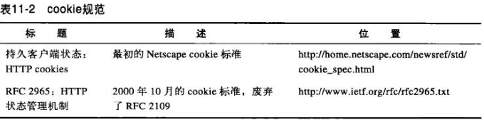

# 第十一章 客户端识别和cookie机制

## 11.1 个性化接触

HTTP最初是一个匿名、无状态的请求/响应协议。现代Web站点希望能够提供个性化的接触。它们希望对连接另一端的用户有更多的了解，并且能在用户浏览页面时对其进行跟踪。Amazon.com这样流行的在线商店网站可以通过一下几种方式实现站点的个性化。
* 个性化的问候 专门为用户生成的欢迎词和内容页面，使购物体验更加个性化。
* 有的放失的推荐 通过了解客户的兴趣，商店可以推荐一些它们认为客户会感兴趣的商品。商店还可以在临近客户生日或其他一些重要日子的时候提供生日特定的商品。
* 管理信息的存档 在线购物的用户不喜欢一次又一次地填写繁琐的地址和信用卡信息，有些站点会将这些管理细节存储在一个数据库中。只要他们识别出用户，就可以使用存档的管理信息，使得购物体验更加便捷。
* 记录会话 HTTP事务是五转泰德。每条请求/响应都是独立进行的。很多Web站点希望能在用户与站点交互的过程中构建增量状态。要实现这一功能，Web站点就需要有一种方式来区分来自不同用户的HTTP事务。

本章对HTTP识别用户的几种技巧进行了总结。HTTP并不是天生就具有丰富的识别特性的。早起的Web站点设计者们都有自己的用户识别技术。每种技术都有其优势和劣势。

## 11.2 HTTP首部

表11-1给出了其中常见的用来承载用户相关信息的HTTP请求首部。这里我们先讨论前三个。

From首部包含了用户的E-mail地址。每个用户都有不同的E-mail地址，所以在理想情况下，可以将这个地址作为可行的源端来识别用户。但由于担心那些不讲道德的服务器会搜集这些E-mail地址，用于垃圾邮件的散发，搜易很少有浏览器会发送From首部。

User-Agent首部可以将用户受用浏览器的相关信息告知服务器，包括程序的买那个城和版本，通常还包含操作系统的相关信息。要实现定制内容与特定的浏览器及其属性的良好互操作时，这个首部是非常有用的，但它并没有为识别特定的用于提供太多有意义的帮助。

Referer首部提供了用户来源页面的URL。refer而首部自身并不能完全表示用户，但它却是说明了用于之前访问过哪个页面。通过它可以更好地理解用户的浏览行为，异界用户的兴趣所在。比如，如果你是从一个篮球网站抵达某个Web服务器的，这个服务器可能会推断你是个篮球迷。

## 11.3 客户端IP地址

如果每个用户都有不同的IP地址，IP地址也很少会发生变化，而且Web服务器可以判断出每条请求的客户端IP地址的话，这种方案是可行的。

但是，使用客户端IP地址来识别用户存在着很多缺点，限制了将其作为用户识别技术的效能。

* 客户端IP地址描述的是所用的机器，而不是用户。如果多个用户共享同一条计算机，就无法对其进行区分了。
* 很多因特网服务提供商都会在用户登录时为其动态分配IP地址。用户每次登录时，都会得到一个不同的地址，因此Web服务器不能假设IP低着可以在各登录会话之间表示用户。
* 为了提高安全性，并对稀缺的地址资源进行管理，很多用户都是通过网络地址转换(NAT)防火墙来浏览网络内容的。这些NAT设备隐藏了防火墙后面那些实际客户端的IP地址，将实际的客户端IP地址转换成了一个共享的防火墙IP地址（和不同的端口号）。
* HTTP代理和网关通常会打开一些新的、到原始服务器的TCP连接。Web服务器看到的监视代理服务器的IP地址，而不是客户端的。由此而代理为了绕过这个问题会添加特殊的Client-IP或X-Forwarded-For扩展首部来保存原始的IP地址。但并不是所有的代理都支持这种行为。

少数站点甚至将客户端IP地址作为一种安全特性使用，它们指向来自特定IP地址的用户提供文档。在内部网络中可能可以这么做，但在因特网上就不行了，主要是因为因特网上IP地址太容易被欺骗了。

## 11.4 用户登录
Web服务器无需被动地根据用户的IP地址来猜测他的身份，他可以要求用户通过用户名和密码进行认证来显示地询问用户是谁。

为了使Web站点的登录更加简便，HTTP中包含了一种内建机制，可以用WWW-Authenticate首部和Authorization首部向Web站点的请求中发送这个登录信息了，这样，就总是有登录信息可用了。

通过服务器向在为用户提供对站点的访问之前，现行登录，可以向浏览器回送一条HTTP响应代码401 Login Required。然后，浏览器会显示一个登录对话框，并用Authorization首部在吓一跳对服务器的请求中提供这些信息。

但是，登录多个站点是很繁琐的。Fred从一个站点浏览到另一个站点的时候，需要在每个站点上登录。更糟糕的是，可怜的Fred很可能要为不同的站点记住不同的用户名和密码。他访问很多站点的时候，他最喜欢的用户名Fred可能已经被其他人用过了，而且有些站点为用户面和密码的长度和组成设置了不同的规则。Fred很快就会放弃上网。

## 11.5 胖URL

有些Web站点会为没有用户生成特定版本的的URL来追踪用户的身份。通常，会对真正的URL进行扩展，在URL路径开始或结束的地方添加一些状态信息。用户浏览站点时，Web服务器会动态生成一些超链，继续维护URL中的状态信息。

改动后包含了用户状态信息的URL被称为胖URL（fat URL）。

可以通过胖URL将Web服务器上若干个独立的HTTP事务捆绑成一个回话或访问。用户首次访问这个Web站点时，会生成一个唯一的ID，用护肤武器可以识别的方式将这个ID添加到URL中去，然后服务器就会将客户端重新导向这个胖URL。不论什么时候，只要服务器收到了对胖URL的请求，就可以去查找与那个用户ID相关的艘油增量状态，然后重写所有的输出超链，使其成为胖URL，已维护用户的ID。

可以在用户浏览站点时，用胖URL对其进行识别。但这种技术存在记这个很严重的问题。

* 丑陋的URL 浏览器中显示的胖URL会给新用户带来困扰
* 无法共享URL 胖URL中包含了与特定用户和回话有短的状态信息。如果将这个URL发送给其他人，可能就在无意中将你积累的个人信息都共享出去了。
* 破坏缓存 为每个URL生成用户特有的版本就意味着不再有可供公共访问的URL需要缓存了。
* 额外的服务器负荷 服务器需要重写HTML页面使URL变胖。
* 逃逸口 用户跳转到其他站点或者请求一个特定的URL时，就很容易在无意中“逃离”胖URL回话。只有当用户严格的追随预先修改过的链接时，胖URL才能工作。古国用户逃离此链接，就会丢失他的进展信息，得重新开始。
* 在回话间是非持久的 除非用户手残了特定的胖URL，否则用户推出登录时，所有的信息都会丢失。

## 11.6 cookie

cookie是当前识别用户，实现持久会话的最好方式。前面各种技术中存在的很多问题对它们都没什么影响，但是通常会将它们与那些技术公用，以实现额外的价值。

cookie非常重要，而且它们定义了一些新的HTTP首部，所以我们要比前面那些技术更详细地介绍它们。cookie的存在也影响了缓存，大多数缓存和浏览器都不允许对任何cookie的内容进行缓存。

### 11.6.1 cookie的类型

可以笼统地将cookie分为两类：会话cookie和持久cookie。会话cookie是一种临时cookie，它记录了用户访问站点时的设置和偏好。用户推出浏览器时，会话cookie就被删除了。持久cookie的生存时间更长一些；它们存储在硬盘上，浏览器退出，计算机重启时它们仍然存在。通常会用持久cookie维护某个用户会周期性访问的站点的配置文件或登录名。

会话cookie和持久cookie之间唯一区别就是它们的过期时间。

### 11.6.2 cookie是如何工作的

### 11.6.3 cookie罐:客户端的状态
cookie的基本思想就是让浏览器积累一组服务器特有的信息，每次访问服务器时都将这些信息提供给它。因为浏览器要负责存储cookie信息，所以此系统被称为客户端侧状态。这个cookie复返的正式名称为HTTP状态管理机制。

### 11.6.4 不同站点使用不同的cookie

浏览器内部的cookie罐中可以有成百上千个cookie，但浏览器不会讲每个cookie都发送给所有的站点。

* 对所有这些cookie字节进行传输会严重降低性能。浏览器实际传输的cookie字节数要比实际的内容字节数多！
* cookie中包含的是服务器特有的名值对，所以对大部分站点来说，大多数cookie都只是无法识别的无用数据。
* 将所有的cookie发送给所有站点会引发潜在的隐私问题，那些你并不信任的站点也会获得你只想发给其他站点的信息。

总之，浏览器指向服务器发送服务器产生的那些cookie。

>cookie的域属性
>>产生cookie的服务器可以向SetCookie响应首部添加一个Domain属性来控制那些站点可以看到那个cookie。下面的HTTP响应首部就是告诉浏览器将cookie User ="mary17" 发送给域".airtravelbargains.com"中的所有站点：
>
	Set-cookie: user="mart17";domain="airtravelbargains.com"

>>如果用户访问的是www.airtravelbargains.com/specials.airtravelbargains.com或任意以.airtravelbargains.com结尾的站点，下列Cookie首部都会被发布出去：
>
	Cookie:user="mary17"

>cookie路径属性
>>cookie规范甚至允许用户将cookie与部分Web站点关联起来。可以通过Path属性来实现这一功能，在这个属性列出的URL前缀下所有cookie都是有效的。
>>
>例如，某个Web服务器可能是由两个住址共享的，每个住址都有独立的cookie。站点www.airtravelbargains.com可能会将部分Web站点用于汽车租赁——比如，www.airtravelbargains.com/autos/——用一个独立的cookie来记录用户喜欢的汽车尺寸。可能会生成一个如下所示的特殊汽车租赁cookie：
>
	Set-cookie:pref=compact;domain="airtravelbargains.com";path=/autos/

>>如果用户访问http://www.airtravelbargains.com/specials.html，就只会获得这个cookie：
>
	Cookie:user="mary17"

>>但如果访问http://www.airtravelbargains.com/autos/cheapo/index.html,就会获得这两个cookie：
>
	Cookie:user="marty17"
	Cookie:pref="compact"

>>因此，cookie就是由服务器贴在客户端上，由客户端维护的状态片段，只会回送给那些合适的站点。下面我们来更仔细地看着cookie的技术标准。

### 11.6.5 cookie成分

### 11.6.6 cookies版本0

最初的cookie规范是由网景公司定义的。这些版本0的cookie定义了Set-Cookie响应首部、cookie请求首部以及用于控制搜欧克的字段。

**版本0的Set-Cookie首部**

**版本0的cookie首部**

客户端发送请求时，会将所有与域、路径和安全过滤器相匹配的未过期cookie都发送给这个站点。所有cookie都被组合刀一个cookie首部中：

	Cookie:session-id=002-1145265-8016838;
	session-id-time=1007884800

### 11.6.8 cookie与绘画跟踪

可以用cookie在用户与波哥Web站点进行多项事务处理时对用户进行跟踪。电子商务Web站点用绘画cookie在用户浏览时记录下用户的购物车信息。我们以流行的购物网站Amazon.com为例。在浏览器中输入http://www.amazon.com时，就启动了一个事务链，在这些事务中Web服务器会通过一些列的重定向、URL重写以及cookie设置来附加标识信息。

* 11-5a——浏览器首次请求Amazon.com根页面。
* 11-5b——服务器将客户端重定向到一个电子商务软件的URL上。
* 11-5c——客户端对重定向的URL发起了一个请求。
* 11-5d——服务器在响应上贴上两个会话cookie，并将用户重定向到另一个URL，这样客户端就会用这些附加的cookie再次发出请求。这个新的URL是个胖URL，也就是说有些状态嵌入到URL中去了。如果客户端禁止了cookie，只要用户一直跟随着Amazon.com产生的胖URL链接，不离开网站，仍然可以实现一些基本的标识功能。
* 11-5e——客户端请求新的URL，但现在回传送两个附加的cookie。
* 11-5f——服务器重定向到home.html页面，并附加灵位两个cookie。
* 11-5g——客户端获取home.html页面并将所有四个cookie都发送出去。
* 11-5h——服务器回送内容。

### 11.6.9 cookie与缓存
缓存那些与cookie事务有关的文档时要特别小心。你不会希望给用户分配一个过去某些用户用过的cookie，或者更糟糕的是，向一个用户展示其他私有文档的内容。

>如果无法缓存文档，要将其表示出来
>>文档的所有者最清楚文档时否时不可缓存的。如果文档不可缓存，就显式地注明——具体来说，如果出了Set-Cookie首部之外文档是可缓存的，就是用Cache-Control：no-cache="Set-Cookie"。另一种更通用的做法是为可缓存文档使用Cache-Control：public，这样与助于节省Web中的带宽。

>缓存Set-Cookie首部时要小心
>>如果响应中有Set-Cookie首部，就可以对主体进行缓存(除非告知不要这么做)，但要特别注意对Set-Cookie首部的缓存。如果想多个用户发送了相同的Set-Cookie首部，可能会破坏用户的定位。
>>
>有些缓存在响应缓存起来之前会删除Set-Cookie首部，但这样也会引发一些问题，因为在没有缓存的时候，通常都会cookie贴在客户端上，但由缓存提供服务的客户端就不会有cookie了。强制缓存与原始服务器重新验证每条请求，并将返回的所有Set-Cookie首部都合并到客户端的响应中去，就可以改善这种状况。原始服务器可以通过向缓存的副本中添加这个首部来要求进行这种再验证：
>
	Cache-Control:nust-rebalidate,max-age=0

>>起边内容实际上是可以缓存的，比较保守的缓存可能也会拒绝缓存所有包含Set-Cookie首部的响应。有些缓存允许使用缓存Set-Cookie图片，但不缓存文本的模式。

>小心处理带有Cookie首部的请求
>带有Cookie首部的请求到达时，就在提示我们，得到的结果可能是私有的。一定要将私有内容标识为不可缓存的，但有些服务器可能会犯错，没有将此内容标记为不可缓存的.
>>
>有些相应文档对应于携带Cookie首部的请求，保守的缓存可能会选择不去缓存这些相应文档。同样，有些缓存允许使用缓存cookie图片，而不缓存文本的模式。得到更广泛接受的策略是缓存带有Cookie首部的图片，将过期时间设置为龙，强制每次都进行再验证。

### 11.6.10 cookie、安全性和隐私
cookie是可以禁止的，而且可以通过日志分析或其他方式来实现大部分跟踪记录，所以cookie自身并不是很大的安全隐患，可以通过提供一个标准的审查方法在远程数据库中保存个人信息，并将匿名cookie作为键值，来降低客户端到服务器的敏感数据传送频率。

但是，潜在的滥用情况总是存在的，所以，在处理由你司和用户跟踪信息时，最好还是要小心一些。第三方Web站点使用持久cookie来跟踪用户就是一种最大的滥用。讲这种做法与IP地址和Refer而首部信息结合在一起，这些营销公司就可以构建起相当精确的用户档案和浏览模式信息。

尽管有那么多负面的宣传，人们通常还是认为，如果能够小心地确认在向谁提供私人信息，并仔细查阅站点的隐私政策，那么，cookie会话处理和事务处理所带来的便利性要比大部分风险更重要。

