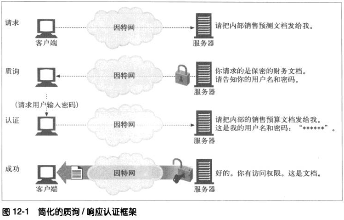

# 第十二章 基本认证机制

## 12.1 认证

认证就是要给出一些身份证明。当出示像护照的身份认证时，就给出了一些证据，说明你就是你说声称的那个人。

现在，这些策略都不是绝对有效的。密码可以被猜出来或被人偶然听到，身份证可能被偷取或被伪造，但美中证据都有助于构建合理的信任，说明你就是你所声称的那个人。

### 12.1.1 HTTP的质询/相应认证框架

HTTP提供了一个原生的质询/小那个盈框架，简化了对用户的认证过程。HTTP的认证模型如下图。

Web应用程序收到一条HTTP请求报文时，服务器没有按照请求执行动作，而是以一个“认证质询”进行响应，要求用户提供一些保密信息来说明他是谁，从而对其进行质询。

用户再次发起请求时，要附上保密证书(用户名和密码)。如果证书不匹配，服务器可以再次质询客户端，或产生一条错误信息。如果证书匹配，就可以正常请求了。

### 12.1.2 认证协议与首部

HTTP通过一组可定制的控制首部，为不同的认证协议提供了一个可扩展框架。表12-1列出的首部格式和内容会随认证协议不同而浮生变化。认证协议也是在HTTP认证首部中指定的。

HTTP定义了两个官方的认证协议：基本认证和摘要认证。今后人们可以随意设计一些使用HTTP质询/响应框架的新协议。

|---|---|---|---|
|步骤|首部|描述|方法/状态|
|请求||第一条请求没有认证信息|GET|
|质询|www-Authenticate|服务器用401状态拒绝了请求，说明需要用户提供用户名和密码。服务器上可能会分为不同的区域，每个区域都有自己的密码，所以服务器会在www-authenticate首部中指定的|401 Unauthorized|
|授权|Authorization|客户端重新发出请求，但这一次会附加一个Authorization首部，用来说明证明算法、用户名和密码|GET|
|成功|Authentication-Info|如果授权证书的正确的，服务器就会将文档返回。有些授权算法会在可选的Authentication-Info首部返回一些与授权相关的附加信息|200 OK|

### 12.1.3 安全域

Web服务器会将受保护的文档组织成一个安全域。每个安全域都可以有不同的授权用户集。

下面是一个假想的基本认证质询,它制定了一个域：

	HTTP/1.0 401 Unauthorized
	WWW-Authenticate：Basic realm="Corporate Finacials"

域应该有一描述性的字符名，比如"Corporate Finacials"，以帮助用户了解应该使用哪个用户名和密码。在安全域的名称中列出服务器主机名也是很有帮助的——比如，executive-committee@bigcompany.com。

## 12.2 基本认证

在基本认证中，Web服务器可以拒绝一个事务，质询客户端，请用户提供有效的用户名和密码。服务器会返回401状态码，而不是200状态码来初始化认证质询，并用WWW-Suthenticate响应首部指定要访问的安全域。浏览器收到质询时，会打开一个对话框，请求用户输入这个域的用户名和密码。然后将用户名和密码稍加扰码，再用Authorization请求首部会送给服务器。

### 12.2.2 Base-64 用户名/密码编码
HTTP基本认证将(由冒号分隔的)用户名和密码打包在一起，并用Base-64编码对其进行编码。简单来说，Base-64编码会将一个8位字节序列划分为一些6位的块。用每个6位的块在一个特殊的由64个字符组成的字母表中选择一个字符，这个字母表中包含了大部分字母和数字。

Base-64编码可以接受二进制字符串，文本，国际字符表示的数据，将其暂时转换成一个易移植的字母表以便传输。

有些用户名和密码中会包含国际自负或其他在HTTP首部中非法的字符，对这些用户名和密码来说，Base-64编码是非常有用的。而且，Base-64编码扰乱了用户名和妈妈，这样也可以防止管理员在管理服务器和网络是，不小心看到用户名和密码。

### 12.2.3 代理认证

中间的代理服务器也可以实现认证功能。有些组织会在用户访问服务器、LAN或无线网络之前，用代理服务器对其进行认证。可以在代理服务器上对访问策略进行集中管理，因此，通过代理服务器提供对某组织内部资源的统一访问控制是一种很便携的方式。

代理认证的步骤与Web服务器身份认证的步骤相同。但不受和状态码都有所不同。

|---|---|
|Web服务器|代理服务器|
|Unauthorized status code ：401|Unauthorized status code ：407|
|WWW-Authenticate|Proxy-Authenticate|
|Authorization|Proxy-Authorzation|
|Authentecation-Info|Proxy-Authentecation-Info|

## 12.3 基本认证的安全缺陷

1. 比本人正会通过网络发送用户名和密码，这些用户名和密码都是以一种很容易解码的形式表示的。
2. 即使密码是以更难解码的方式加密的，第三方用户仍然可以铺货被修改过得用户名和密码，并将修改过的用户名和密码一次一侧地重放给原始服务器，已获得对服务器的访问权。没有什么措施可用来防止这些重放攻击。
3. 即使将基本认证用于一些不太重要的应用程序，比如公司内部网络的访问控制或个性化内容的访问，一些不良习惯会将它变得很危险。很多用户由于受不了大量密码保护的服务，会在这些服务间使用相同的用户名和密码。比如说，某个狡猾的恶徒会从免费的因特网邮件捕获明文形式的用户名和密码，然后会发现用同样的用户名和密码还可以访问重要的在线银行网站。
4. 基本认证没有提供任何针对代理和作为中间人的中间节点的防护措施，它们没有修改认证首部，但却改了报文的其余部分，这样就严重地改变了事务的本质。
5. 假冒服务器很容易骗过基本认证。如果用户实际连接到一台恶意服务器或网关的时候，能够让用户相信他连接的是一个受基本认证保护的合法主机，攻击者就可以请求用户输入密码，将其存储起来以备未来使用，然后捏造一条错误信息传送给用户。