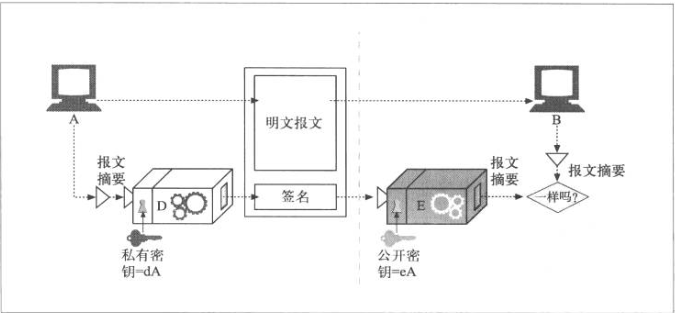
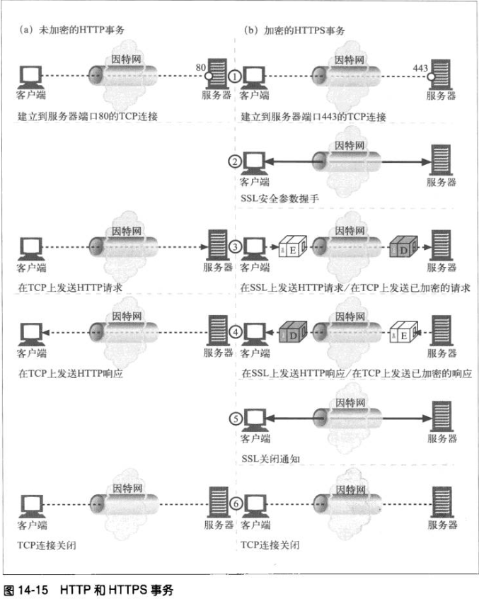
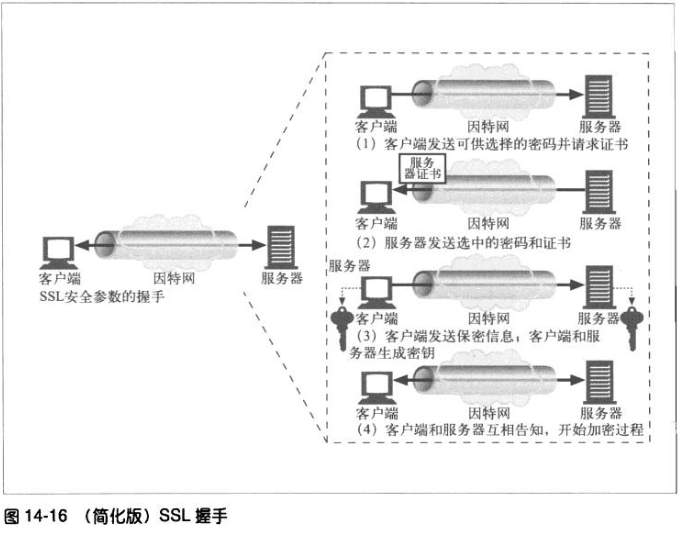

# 第十四章 安全HTTP

## HTTPS

HTTP的安全版本要高效、可移植且易于管理，不但能够适应不断变化的情况而且还应该能满足社会和政府的各项要求。我们需要一种能够提供下列功能的HTTP安全技术。

* 服务器认证（客户端知道它们是在与真正的而不是伪造的服务器通话）。
* 客户端认证（客户端知道它们是在与真正的而不是为找的客户端通话）。
* 完整性（客户端和服务器的数据不会被修改）。
* 加密（客户端和服务器的对话是私密的，无需担心被窃听）。
* 普适性（基本上所有的客户端和服务器都支持这些协议）。
* 管理的可扩展性（在任何地方的任何人都可以立即进行安全通信）。
* 适应性（能够支持当前最知名的安全方法）。
* 在社会上的可行性（满足社会的政治文化需求）。

HTTPS是最流行的HTTP安全形式。所有主要的浏览器和服务器都支持此协议。

HTTPS的方案的URL以https://开头，据此就可以分辨某个Web页面时通过HTTPS而不是HTTP访问的。

使用HTTPS时，所有的HTTP请求和响应数据在发送到网络之前，都要进行加密。HTTPS在HTTP下面提供了一个传输级的密码安全层——可以使用SSL，也可以使用其后继者——传输层安全（TSL）。

大部分困难的编码及解码工作都是在SSL库中完成的，所以Web客户端和服务器在使用安全HTTP时无需过多地修改其协议处理逻辑。在大多数情况下，只需要用SSL的输入/输出调用取代TCP的调用，再增加其他几个调用来配置和管理安全信息就行了。

## 14.2 数字加密

### 14.2.1 密码编制的机制和技巧

密码学是对报文进行编/解码的机制与技巧。人们用加密的方式来发送私密信息已经有数千年了。但密码学所能做的还不仅仅是加密报文以防止好事者的读取，我们还可以用它来防止对报文的篡改，甚至还可以用密码学来证明某条报文或某个事务确实出自你手。

### 14.2.2 密码

密码学基于一种名为密码（cipher）的秘密代码。密码是一套编码方案——一种特殊的报文编码方式和一种稍后使用的响应解码方式的结合体。加密之前的原始报文通常被称为明文。使用了密码之后的编码报文通常被称作密文。

### 14.2.3 密码机

最初，人们需要自己进行编码和解码，所以起初密码是相当简单的算法。因为密码很简单，所以人们通过纸笔和密码输就可以进行编解码了，但聪明人也可以相当容易地“破解”这些密码。

随着技术的进步，人们开始制造一些机器，这些机器可以用复杂得多的密码来快速精确地对报文进行编解码。这些密码机不仅能做一些简单的旋转，它们还可以替换字符、改变字符顺序，将报文切片切块，使代码破解更加困难。

### 14.2.4 使用了秘钥的密码

编码算法和编码机都可能会落入敌人的手中，所以大部分机器上都有一些号盘，可以将其设置为大量不同的值以改变密码的工作方式。即使机器被盗，没有正确的号盘设置，解码器也无法工作。

这些密码参数被称为秘钥（key）。要在密码集中输入正确的秘钥，密码秘钥会让一个密码机看起来好像是多个虚拟密码机一样，每个密码机都有不同的秘钥值，因此其行为都会有所不同。

### 14.2.5 数字加密

随着数字计算的出现，出现了一下两个主要的进展。

* 从机械设备的速度和功能限制中解放出来，使复杂的编/解码算法成为可能。
* 支持超大秘钥成为可能，这样就可以从一个加密算法中产生数万亿的虚拟加密算法，由不同的秘钥值来区分不同的算法。秘钥越长，编码组合就越多，通过随机猜测秘钥来破解代码就越困难。

与金属秘钥或机械设备中的号盘设置相比，数字秘钥只是一些数字。这些数字秘钥值是编/解码算法的输入编码算法就是一些函数，这些函数会读取一块数据，并根据算法和秘钥值对其进行编/解码。

## 14.3 对称秘钥加密技术

很多数字加密算法都被称为对称秘钥（symmetric-key）加密技术，这是因为它们在编码时使用的秘钥值和解码时一样。我们就将其统称为秘钥k。

在对称秘钥加密技术中，发送端和接收端要共享相同的秘钥k才能进行通信。发送端用共享的秘钥来加密报文，并将得到的密文发送给接收端。接收端收到密文，并对其应用解密函数和相同的共享秘钥，恢复出原始的明文。

流行的对称秘钥加密算法包括：DES、Triple-DES、RC2和RC4。

### 14.3.1 秘钥长度与枚举攻击

保持秘钥的机密状态是很重要的。在很多情况下，编/解码算法都是中所周知的，因此秘钥就是唯一保密的东西了。

好的加密算法会迫使攻击者试遍每一个可能的秘钥，才能破解代码。如果只有可能的秘钥值，居心不良的人通过暴力遍历所有值，就能最终破解代码了。但如果有大量可能的秘钥值，他可能就要花费数天、数年，甚至无限长的时间来遍历所有的秘钥，出查找能够破解密码的哪一个。

对于对称秘钥加密技术，128位的秘钥被认为是非常强大的。实际上长秘钥对密码安全有着非常重要的影响，没过政府甚至对使用长秘钥的加密软件实施了出口控制，以防止潜在的敌对组织穿检出没过安全局自己都无法破解的秘密代码。

### 14.3.2 建立共享秘钥

对称秘钥加密技术的缺点之一就是发送者和接收者在互相对话之前，一定要有一个共享的保密秘钥。

如果有N个节点，每个节点都要和其他所有N-1个节点进行安全对话，总共大概有N2个保密秘钥：浙江是一个管理噩梦。

### 14.4 公开秘钥加密技术

公开秘钥加密技术没有为每对主机使用单独的加密/解密秘钥，而是使用了两个费对称秘钥：一个用对主机报文编码，另一个用来对主机报文解码。编码秘钥是众所周知的，但只有主机才知道私有的解密秘钥。这样每个人都能找到某个特定主机的公开秘钥，迷药的建立变得更加简单。

### 14.4.1 RSA

所有公开秘钥非对称加密系统所面临的共同挑战是，要确保几遍有人拥有了下面所有的线索，也无法计算出保密的私有秘钥：

* 公开密钥；
* 一小片拦截下来的密文
* 一条豹纹及与之相关的密文。

RSA算法就是一个满足了所有这些条件的流行的公开秘钥加密系统。即使有了公共秘钥、任意一端明文、用公共秘钥对明文编码之后得到的相关密文、RSA算法自身、甚至RSA实现的源代码、破解代码找到相应的私有迷药的难度仍相当于对一个极大地数进行质因数分解的困难程度。

### 14.4.2 混合加密系统和回话秘钥

非对称的公开秘钥加密系统是很好用的。但公开秘钥加密算法的计算可能会很慢。实际上它混合使用了对称和非对称策略。比如，比较常见的做法是在两节点见通过便捷的公开秘钥加密技术建立起安全通信，然后再用安全通道产生并发送临时的随机对称秘钥，通过更快地对称加密技术对其余数据进行加密。

## 14.5 数字签名

除了加/解密报文之外，还可以用加密系统对报文进行签名，以说明是谁编写的报文，同时证明报文违背篡改过。这种技术被称为数字签名。

数字签名是附加在报文上的特殊加密校验码。使用数字签名有一下两个好处。

* 签名可以证明是作者编写了这条报文。只有作者才会有最机密的私有秘钥，因此，只有作者才能计算出这些校验和。校验和就像来自作者的个人“签名”一样。
* 签名可以防止报文被篡改。如果有恶意攻击者在报文传输过程中对其进行了修改，校验和就不再匹配了。由于校验和只有作者保密的私有秘钥才能产生，所以攻击者无法为篡改了的报文伪造出正确的校验码。

数字签名通常是非对称公开秘钥技术产生的。因为只有所有者才知道其私有密钥，所以可以将坐着的私有密钥当做一种“指纹”使用。

下面显示了一个例子，说明节点A是如何向节点B发送一条报文，并对其进行签名的。

* 节点A将变长报文提取为定长的摘要。
* 加点A对摘要应用了一个“签名”函数，这个函数会将用户的私有秘钥作为参数。因为只有用户才知道私有秘钥，所以正确的签名函数会说明者就是其所有者。在途中，由于解码函数D中包含了用户的私有秘钥，所以我们将其作为签名函数使用。
* 一旦计算出签名，节点A就将其附加在报文的末尾，并将报文和签名都发送给B。
* 在接收端，如果节点B需要确定报文确实是节点A写的，而且没有被篡改过，节点B就可以对起那名进行检查。节点B接受将私有秘钥扰码的签名，并应用了使用公开密钥的反函数。如果拆包后的摘要与节点B自己的摘要版本不匹配，要么就是报文在传输过程中被篡改了，要么就是发送端没有节点A的私有密钥。

## 数字证书

本届将介绍因特网上的“ID卡”——数字证书。数字证书中包含了有某个受信任组织担保的用户或公司的相关信息。

### 14.6.1 证书的主要内容

数字证书中包含一组信息，所有这些信息都是由一个官方的“证书颁发机构”以数字签名方式签发的。基本的数字证书中通常包含一些纸质ID中常见的内容，比如：

* 对象的名称
* 过期时间
* 证书发布者
* 来自证书发布者的数字签名

### 14.6.3 用证书对服务器进行认证
通过HTTPS建立了一个安全Web事务之后，现代的浏览器都会自动获取所连接服务器的数字证书。如果服务器没有证书，安全连接就会失败。服务器证书包含很多字段，其中包括：

* Web站点的名称和主机名；
* Web站点的公开密钥；
* 签名颁发机构的名称；
* 来自起那名颁发机构的签名。

浏览器收到证书会对签名颁发机构进行检查。如果这个机构是很有权威的公共签名机构，浏览器肯定已经知道其公开密钥了。这样就可以请前面的14.5节中讨论的那样验证签名了。

## 14.7 HTTPS——细节介绍

### 14.7.1 HTTPS概述

HTTPS就是在安全地传输层上发送的HTTP。HTTPS在将HTTP报文发送给TCP之前，先将其发送给了一个安全层对其进行加密。

### 14.7.2 HTTPS方案

现在，安全HTTP时可选的。因此，对Web服务器发起请求时，我们需要有一种方式来告知Web服务器去执行HTTP的安全协议版本。这是在URL的方法中实现的。

请求一个客户端对某Web资源执行某事物时，它会检查URL的方案。

* 如果URL的方案为http，客户端就会打开一条服务器端口80（默认情况下）的连接，并向其发送老的HTTP命令。
* 如果URL的方案为https，客户端就会打开一条道服务器端口443（默认情况下）的连接，然后与服务器“握手”，以二进制格式与服务器交换一些SSL安全参数，附加加密的HTTP命令。

SSL是个二进制协议，与HTTP完全不同，其流量是承载在另一个端口上的。如果SSL和HTTP流量都从端口80到达，大部分Web服务器会将二进制SSL流量理解为错误的HTTP并关闭连接。将安全服务进一步整合到HTTP层中去就无需使用多个目的端口了，在实际中这样不会引发严重的问题。

### 14.7.3 建立安全传输

在诶加密的HTTP中，客户端会打开一条道Web服务器端口80的TCP连接，发送一条请求报文，接受一条响应报文，关闭连接。

由于SSL安全曾德存在，HTTPS中这个过程会略微复杂一些。宅HTTPS中，客户端受限打开一条道Web服务器端口443的连接。一点建立了TCP连接，客户端和服务器就会初始化SSL层，对加密参数进行沟通，biang交换密钥。握手完成之后，SSL初始化就完成了，客户端就可以将请求报文发送给安全层了。在讲这些报文发送给TCP之前，要先对其进行加密。

### 14.7.4 SSL握手

在发送已加密的HTTP报文之前，客户端和服务器要进行一次SSL握手，在这个握手过程中，它们要完成一下工作：

* 交换协议版本号
* 选择一个两端都了解的密码
* 对两段的身份进行认证
* 生成临时的会话秘钥，以便加密信道。

在通过网络任何已加密的HTTP数据之前，SSL已经发送一组握手数据来建立通信连接了。图14-6显示了SSL握手的基本思想。

### 14.7-5 服务器证书

SSL支持双向认证，将服务器证书承载回客户端，再将客户端的证书回送给服务器。而现在，浏览器并不经常使用客户端证书。

另一方面，安全HTTPS事务总是要求使用服务器证书的。在一个Web服务器上执行安全事务，比如提交信用卡信息时，你总希望是在与你认为的那个组织对话。由知名权威机构签发的服务器证书可以帮助你发送信用卡或喜人信息之前评估你对服务器的信任度。

### 14.7.6 站点证书的有效性

SSL自身不要求用户检查Web检查Web服务器证书，但大部分相待浏览器都会对证书进行简单的完整性姜茶，并为用户提供进行进一步彻查的手段。验证步骤如下所述。

>日期检测
>>首先，浏览器检查证书的起始日期和结束日期，以确保证书仍有效。如果证书过期了，或还未被激活，则证书有效性验证失败，浏览器显示一条错误信息。

>签名颁发者可信度检测
>>每个证书都是由某些证书颁发机构(CA)签发的，它们负责为服务器担保。证书有不同的等级，每种证书都要求不同级别的背景验证。比如，申请某个电子商务服务器证书，通常需要提供一个营业的合法证明。
>>
>任何人都可以生成证书，但有些CA是非常著名的组织，它们通过非常清晰的流程验证证书申请人的身份及商业行为的合法性。

>签名检测
>>一旦判定签名授权是可信的，浏览器就要对签名使用签名颁发机构的公开密钥，并将其与校验码进行比较，以查看证书的完整性。

>站点身份检测
>>为防止服务器复制其他人的证书，或拦截其他人的流量，大部分浏览器都会试着去验证证书的域名与它们所对话的服务器的玉米那是够匹配。服务器证书中通常包含一个域名，但有些CA会为一组或一群服务器创建一些包含了服务器名称列表或统配域名的证书。如果主机名与证书中的标识符不匹配，面向用户的客户端要么就去通知用户，要么就以表示证书不正确的差错报文来终止连接。

### 14.7.7 虚拟主机与证书

对虚拟主机站点上安全流量的处理有时是很棘手的。有些流行的Web服务器程序只支持一个证书。如果用户请求的是一个证书。如果用户请求的是虚拟主机名，与证书名称并不严格匹配，浏览器就会显示警告框。

为防止出现这个问题，Cajun-Shop.com的所有者会在开始处理安全事务时，将所有用户都重定向到cajun-shop.securesites.com。虚拟主机站点的证书管理会稍微棘手一些。

## 14.8 HTTPS客户端实例

## 14.9 通过代理隧道形式传输安全流量

客户端通常会用Web代理服务器代表它们来访问Web服务器。比如，很多公司会在公司网络和公共因特网的安全便捷上放置一个代理。代理时防火路由器唯一允许进行HTTP流量交换的设备，他可能会进行病毒检测或其他的内容控制工作。

但只要客户端开始用服务器的公开密钥对法网服务器的数据进行加密，代理就再也不能读物HTTP首部了！代理不能读取HTTP首部，就无法知道应该请求转向何处了。

为了使HTTPS与代理配合工作，要进行基础修改一告知代理连接到何处。一种常用的技术就是HTTPS SSL隧道协议。使用HTTPS隧道协议，客户端受限要告知代理，他想要连接的安全主机和端口。这是在开始加密之前，以明文形式告知的，搜易代理可以理解这条信息。

HTTP通过新的名为CONNECT的扩展方法在发送明文形式的端点信息。CONNECT方法会告诉代理，打开一条道所期望主机和端口号的连接。这项工作完成之后，直接在客户端和服务器之间以隧道形式传输数据。CONNECT方法就是一条单行的文本命令，它提供了有冒号分隔的安全原始服务器的主机名和端口号。

	CONNECT home.netscape.com:443 HTTP/1.0
	User-agent: Mozilla/1.1N

	<raw SSL-encryted data would follow here...>

在请求中空行之后，客户端会等待来自代理的响应。代理会对请求进行评估，确保它是有效的，而且用户有权请求这样一条连接。如果一切正常，代理会建立一条道目标服务器的连接。如果成功，就会想客户端发送一条200 Connection Established响应。

